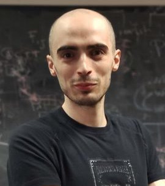

## Course Description

Reference genomes are central to most bioinformatics approaches. However, the use of a single reference genome to guide an analysis can result in reference bias: other genomes appear more similar to the reference than they actually are. We might miss, or misunderstand information about genome variability and relationship that cannot be expressed relative to a chosen reference genome. Moreover, new assembly methods are making it easier than ever to generate high-quality complete genome assemblies. To obtain a total understanding of variation between multiple whole genomes, we need to use a model that expresses many genomes and their mutual alignment. A general solution to these problems is to use a pangenome graph wherein genomes are described as labeled walks through an underlying s equence graph. In this course, we will work with methods to build such graphs from whole genome assemblies, and to use the built graphs in an array of downstream applications in comparative genomics, evolution, variation analysis, sequence alignment, and phenotype association.

---

## Target Audience

This course is oriented towards biologists and bioinformaticians. The course will be of particular interest to researchers investigating organisms without a reference genome or populations featuring high levels of genetic diversity, to researchers in comparative genomics, and to researchers who are assembling pangenomes of any species.

---

## Detailed Program

### Introduction
- [Slides](assets/CPANG22%20-%20Day%201a%20-%20Introduction.pdf)
- [Activities](pages/Day1a_Introduction.md)

### PGGB
- [Slides](assets/CPANG22%20-%20Day%201b%20-%20PGGB.pdf)
- [Activities - Build your first pangenomes](pages/Day1b_PGGB.md)

### Pangenome visualization
- [Slides](assets/CPANG22%20-%20Day%202a%20-%20Pangenome%20visualization.pdf)

### Homo sapiens pangenomes
- [Activities - Pangenome building](pages/Day2a_Homo_sapiens_pangenome_graphs.md)
- [Activities - Deep exploration](pages/Day3a_Pangenome_subgraphs.md)

### ODGI
- [Slides](assets/CPANG22%20-%20Day%203a%20-%20ODGI.pdf)

### Saccharomyces cerevisiae pangenomes
- [Activities - Divergence estimation and pangenome building](pages/Day3b_Saccharomyces_cerevisiae_pangenome_graphs.md)
- [Activities - Community detection](pages/Day4a_Saccharomyces_cerevisiae_pangenome_graphs.md)

### Read mapping and variant calling
- [Activities](pages/Day4b_Read_mapping.md)

### Other notes
- [Notes](https://hackmd.io/@i-Mv45MZTMa2ZQH2rMAArQ/cpang22notes)

---

### Learning objectives
Participants will develop an understanding of pangenome concepts, and refine this through practical experience with methods to build and interrogate pangenome graphs.
We will apply these methods to difficult study questions wherein we need to understand the relationship between many genomes, or account for variability when we analyze new genomes.
Participants will leave with a deep understanding of pangenome methods based on whole genome assemblies.

---

### Instructors

#### [Erik Garrison](https://github.com/ekg)
**Affiliation:** University of Tennessee Health Science Center, Memphis, TN, US

  

  [Erik Garrison](http://hypervolu.me/~erik/erik_garrison.html) is a Postdoctoral fellow at the University of California,Santa Cruz. His research has focused on the development of a software toolkit for practical pangenomics: [vg](https://github.com/vgteam/vg).

  Erik Garrison builds methods that let us understand the precise relationships between thousands of genomes. His work on this topic began with the development of Bayesian methods to detect and genotype genomic variants, with application of these methods to the thousands of human genomes cataloged in the 1000 Genomes Project. Lessons learned in that effort guided him to work on unbiased methods for genome inference based on graphical models of pangenomes. In these, the genome is encoded in a graph that may represent a population sample of individuals from the same species, a metagenome, the diploid genome of a single individual, or any other useful collection of genomic sequence information. Erik have shown that this approach provides more accurate alignment of reads when it is possible to construct a high-quality pangenome, and is currently applying it to the construction of pangenome graphs for humans as part of the HPRC.

---

#### [Andrea Guarracino](https://github.com/AndreaGuarracino)
**Affiliation:** Human Technopole, Milan, IT

  

  Andrea Guarracino is a Scientific Advisor at the Human Technopole in Milan, where he is part of the Pangenomic Research Unit, a bioinformatics group dedicated to the development and application of new methods to analyze collections of sequences (also called pangenomes). After a degree in computer engineering and an experience in a software company, he met biology by chance and fell in love with it. He then decided to pursue a master's degree in bioinformatics and then a PhD in the same field. During his doctorate, he explored chromosomal instability in colorectal cancer stem cells for the development of novel therapeutic approaches. In the middle of his research, "thanks" to the pandemic, he attended a virtual event where he encountered pangenomics and began actively working on developing new tools for building and analyzing pangenomes, which he is still currently doing.

---

### Helpers

  
[Flavia Villani](https://github.com/Flavia95)
**Affiliation:** University of Tennessee Health Science Center, Memphis, TN, US

#### [Njagi Mwaniki](https://github.com/urbanslug)
**Affiliation:** University of Pisa, Pisa, Italy

---

The source for this course webpage is [in github](https://github.com/GTPB/Web_course_template).

 

 Web_course_template by GTPB is licensed under a <a rel="license" href="http://creativecommons.org/licenses/by/4.0/">Creative Commons Attribution 4.0 International License</a>.
