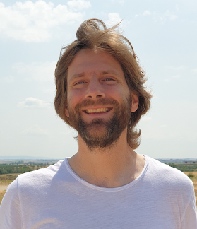
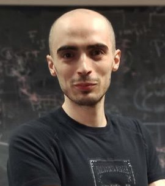

### Erik Garrison
**Affiliation:** University of Tennessee Health Science Center, Memphis, TN, US

[Erik Garrison](http://hypervolu.me/~erik/erik_garrison.html)s a Postdoctoral fellow at the University of California,Santa Cruz. His research has focused on the development of a software toolkit for practical pangenomics: [vg](https://github.com/vgteam/vg).

Erik Garrison builds methods that let us understand the precise relationships between thousands of genomes. His work on this topic began with the development of Bayesian methods to detect and genotype genomic variants, with application of these methods to the thousands of human genomes cataloged in the 1000 Genomes Project. Lessons learned in that effort guided him to work on unbiased methods for genome inference based on graphical models of pangenomes. In these, the genome is encoded in a graph that may represent a population sample of individuals from the same species, a metagenome, the diploid genome of a single individual, or any other useful collection of genomic sequence information. Erik have shown that this approach provides more accurate alignment of reads when it is possible to construct a high-quality pangenome, and is currently applying it to the construction of pangenome graphs for humans as part of the HPRC.

 

---

### Andrea Guarracino
**Affiliation:** Human Technopole, Milan, IT

Andrea Guarracino is a Scientific Advisor at the Human Technopole in Milan, where he is part of the Pangenomic Research Unit, a bioinformatics group dedicated to the development and application of new methods to analyze collections of sequences (also called pangenomes). After a degree in computer engineering and an experience in a software company, he met biology by chance and fell in love with it. He then decided to pursue a master's degree in bioinformatics and then a PhD in the same field. During his doctorate, he explored chromosomal instability in colorectal cancer stem cells for the development of novel therapeutic approaches. In the middle of his research, "thanks" to the pandemic, he attended a virtual event where he encountered pangenomics and began actively working on developing new tools for building and analyzing pangenomes, which he is still currently doing.

 

### Back

Back to [main page](../index.md).
